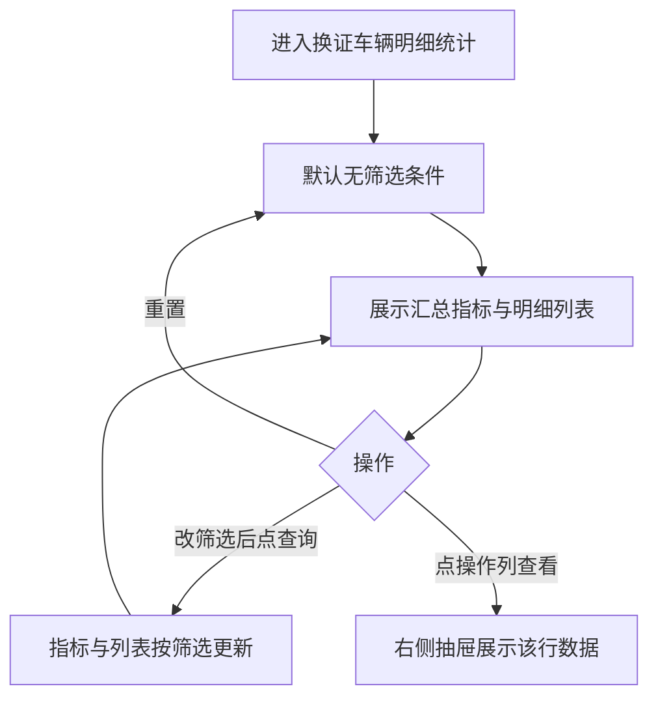

<!-- #AI:prd:file -->
# PRD：数据中心 · 换证车辆明细统计

- 所属系统：花乡商管 PC（市场端管理后台）
- 所属模块：**数据中心** / **换证车辆明细统计**
- 需求类型：数据统计报表（筛选 + 汇总指标 + 分组明细列表 + 详情抽屉）
- 涉及端：PC
- 来源：YAN 提供「车辆换证」录入表单字段截图（2026-09-04 更正版）+ 现有「统计报表 · 车辆换证」页面截图（2026-09-04）
- 文档状态：**已确认（2026-09-04 两轮确认完成），无剩余待确认项**

## 变更记录

| 日期 | 变更内容 |
| --- | --- |
| 2026-09-04 | 初版。按换证录入表单字段整理统计维度、筛选、指标、列表、详情；口径全部列入待确认 |
| 2026-09-04 | 按更正截图修字段：「着装类型（流动证/登记证）」更正为「证件类型（行驶证证/登记证）」；新行驶证照片提示文案更正；新增可选字段「备注」；相关筛选、指标、列表、详情、文案同步更新 |
| 2026-09-04 | YAN 逐条确认 8 项口径；结合现有「统计报表 · 车辆换证」页面截图重构统计结构：新增换证来源（普通换证/指标腾出换证）、车辆类型（新车/二手车）、换证车辆服务费、操作人员维度；列表改为分组合并展示 + 合计行；操作列改为【查看】右侧抽屉；导出默认 xlsx |
| 2026-09-04 | 第二轮确认：取数来源澄清（录入截图仅为普通换证，指标腾出换证有现成数据来源；车辆类型由 VIN 关联录入时的新车/二手车；服务费固定 10 元/笔、有现成接口）；支付方式保留两种；保留证件类型筛选；取消打印按钮，数据统计列表统一为「查询数据导出」；导出不含合计行；详情抽屉下方展开车辆明细列表 |
| 2026-09-04 | YAN 修正：支付方式筛选默认由「扫码支付」改为「全部」，选项增加「全部」，避免初始汇总指标漏统计 2SC 账户支付 |
| 2026-09-07 | YAN 修正筛选：支付方式改为选择框；取消证件类型筛选，改为换证来源；新增车辆类型；筛选模块两行上下间距调整为 20px |
| 2026-09-07 | YAN 修正展示与列表：8 项指标拆为两行；列表移除换证车辆总数；所属市场、换证车辆日期、操作人员按每条来源×车辆类型明细重复展示，不再合并 |
| 2026-09-07 | 列表换证车辆日期统一展示时分秒 |
| 2026-09-07 | YAN 调整：取消支付方式筛选；移除列表底部合计行 |

> 实现与验收以本文表格为准。预览数字均为假数据，不作为统计口径或验收数值。

## 第一部分 · 概念对齐

市场员工在 PC 数据中心查看换证车辆的汇总统计与明细列表，并可打开单行详情查看。明细按「所属市场 + 换证车辆日期 + 操作人员」为一条记录，其下按「换证来源（普通换证/指标腾出换证）× 车辆类型（新车/二手车）」拆行展示数量与服务费。本期只覆盖「换证车辆明细统计」一页。

## 第二部分 · 落地需求

## 1. 业务目标

在数据中心提供换证车辆明细统计：按所属市场、操作人员、时间日期、换证来源、车辆类型筛选后，同时更新上方汇总指标与下方明细列表；从列表操作列【详情】以右侧抽屉展示该行数据。

## 2. 入口与范围

- 入口：数据中心 → 换证车辆明细统计
- 本期页面：本报表（筛选 + 汇总指标 + 明细列表 + 详情抽屉）
- 不做：数据中心其它子菜单；无数据/加载失败展示（本次不开发，已确认）

## 3. 核心动线



## 4. 功能清单

```
换证车辆明细统计
├── 筛选：所属市场、操作人员、时间日期、换证来源、车辆类型；查询 / 重置 / 查询数据导出（xlsx）
├── 上方汇总指标：第一行展示换证车辆 / 普通换证车辆 / 普通换证车辆（新车） / 普通换证车辆（二手车）；第二行展示指标腾出换证车辆 / 指标腾出换证车辆（新车） / 指标腾出换证车辆（二手车） / 换证车辆服务费
├── 明细列表：按来源×车辆类型拆行展示 + 分页
└── 操作列【详情】→ 右侧抽屉详情
```

## 5. 页面字段与交互

### 5.1 录入字段基准（来自「车辆换证」表单，只读引用）

| 分组 | 字段 | 形态 | 必填 | 说明 |
| --- | --- | --- | --- | --- |
| 车辆信息 | 车辆图片 | 图片（系统带出） | — | 表单左上角展示 |
| 车辆信息 | 车型 | 文本（系统带出） | — | 如：奔驰E级 2024款 E 300 L 尊贵型 |
| 车辆信息 | 车架号 | 文本（系统带出） | — | 如：LE4LG4GB1RL028810 |
| 车辆信息 | 所属市场 | 文本（系统带出） | — | 如：北京市旧机动车交易市场有限公司 |
| 车辆信息 | 注册日期 / 里程 / 排量 / 颜色 | 文本（系统带出） | — | 如：2024-10-14 0.83万公里 2 T 蓝色 |
| 车辆信息 | 价格 | 文本（系统带出） | — | 如：30万元 |
| 车辆信息 | 商户信息 | 文本（系统带出） | — | 公司 + 联系人 + 手机号，如：北京中盛聚鑫汽车销售有限公司 李亚男 13910758968 |
| 换证录入 | 证件类型 | 分段选择 | 是 | 行驶证证 / 登记证 |
| 换证录入 | 换证申请书 | 图片上传 | 是 | — |
| 换证录入 | 新行驶证照片 | 图片上传 | 是 | 提示：行驶证图片仅用于审核不展示或其他用途；最多1张，建议比例4:3 |
| 换证录入 | 车架号 | 输入 | 是 | — |
| 换证录入 | 车牌号 | 省份简称下拉 + 输入 | 是 | 如：京 + 车牌号 |
| 换证录入 | 经办人手机号 | 选择 | 是 | — |
| 换证录入 | 经办人 | 选择（与手机号联动） | 是 | — |
| 换证录入 | 新车预售价 | 金额输入（万元） | 是 | — |
| 换证录入 | 支付方式 | 下拉选择 | 是 | 扫码支付 / 2SC账户支付（已确认两种均保留） |
| 换证录入 | 备注 | 多行文本 | 否 | 更正截图新增字段 |

> 统计侧维度「换证来源」「车辆类型」「换证车辆服务费」不在录入表单截图中，取数来源见 5.1.1（已确认）。

### 5.1.1 统计维度取数来源（已确认）

- **换证来源**：录入表单截图为「普通换证」；「指标腾出换证」另有自己的数据来源，实际可取到。
- **车辆类型**：由车辆 VIN 关联获取——录入车辆时已填写新车/二手车。
- **换证车辆服务费**：固定金额 **10 元/笔**，有现成数据接口。

### 5.2 筛选

筛选作用于**上方指标**和**下方列表**，共用同一套条件。对齐现有页面筛选布局：

| 字段 | 控件 | 选项 / 格式 | 默认 | 说明 |
| --- | --- | --- | --- | --- |
| 所属市场 | 下拉 | 请选择市场 | 空 | — |
| 操作人员 | 下拉 | 请选择操作人员 | 空 | — |
| 时间日期 | 日期范围 | 开始日期 至 结束日期 | 空 | 按换证日期过滤；口径见 5.4 |
| 换证来源 | 下拉 | 全部、普通换证、指标腾出换证 | 全部 | 按换证来源过滤列表 |
| 车辆类型 | 下拉 | 全部、新车、二手车 | 全部 | 按车辆类型过滤列表 |
| 查询 | 按钮 | — | — | 刷新指标与列表，页码回第 1 页 |
| 重置 | 按钮 | — | — | 恢复默认，页码回第 1 页 |
| 查询数据导出 | 按钮 | — | — | 导出当前筛选下列表全部行，**xlsx** 格式；不含合计行（已确认）。数据统计各页导出按钮文案统一为「查询数据导出」；不设打印按钮 |

筛选模块按两行布局时，第一行与第二行的上下间距为 **20px**。

### 5.3 上方汇总指标

| 顺序 | 指标名 | 单位 | 口径 |
| --- | --- | --- | --- |
| 1 | 换证车辆 | 辆 | 当前筛选范围内换证来源×车辆类型明细数量合计 |
| 2 | 普通换证车辆 | 辆 | 换证来源=普通换证的车辆数量 |
| 3 | 指标腾出换证车辆 | 辆 | 换证来源=指标腾出换证的车辆数量 |
| 4 | 普通换证车辆（新车） | 辆 | 换证来源=普通换证、车辆类型=新车的车辆数量 |
| 5 | 指标腾出换证车辆（新车） | 辆 | 换证来源=指标腾出换证、车辆类型=新车的车辆数量 |
| 6 | 普通换证车辆（二手车） | 辆 | 换证来源=普通换证、车辆类型=二手车的车辆数量 |
| 7 | 指标腾出换证车辆（二手车） | 辆 | 换证来源=指标腾出换证、车辆类型=二手车的车辆数量 |
| 8 | 换证车辆服务费 | 元 | 换证车辆数量 × 10 元/笔 |

### 5.4 明细列表 + 分页

**换证日期口径（已确认）**：换证分两种来源——普通换证取**提交时间**（无需审核）；指标腾出换证取**审核通过时间**。

列结构对齐现有「车辆换证」统计页，并新增操作列：

| 列名 | 说明 |
| --- | --- |
| 序号 | 记录序号 |
| 所属市场 | — |
| 换证车辆日期 | 口径见上，展示格式为 YYYY-MM-DD HH:mm:ss |
| 操作人员 | — |
| 换证车辆来源 | 普通换证 / 指标腾出换证 |
| 车辆类型 | 新车 / 二手车 |
| 数量 | 来源×类型组合下的车辆数 |
| 换证车辆服务费（元） | 来源×类型组合下的服务费；固定 **10 元/笔**（已确认，取现成数据接口） |
| 操作 | 绿色文字【详情】；点击后展示该行数据及对应车辆明细 |

- **逐行展示**：序号按列表从上到下对每条来源×车辆类型明细行连续递增；所属市场、换证车辆日期、操作人员、来源、车辆类型、数量、服务费、操作均按每条明细行展示，不合并单元格。
- 分页：每页 10 条记录。
- 备注字段不进列表（已确认）。

### 5.5 详情（已确认：右侧抽屉 + 车辆明细列表）

- 形态：**右侧抽屉**展开（与车辆检测统计一致）。
- 内容分两部分：
  1. 上方：展示**该行列表数据**（所属市场、换证车辆日期、人员、换证车辆来源、车辆类型、数量、换证车辆服务费）；指标腾出换证的人员文案为「腾出人」，普通换证为「操作人员」；人员值与下方车辆明细一致，多人时使用「、」连接。
  2. 下方：**展开该行对应的车辆明细列表**。普通换证展示车牌号、车架号、车型、证件类型、新车预售价、支付方式、经办人、备注、换证日期；指标腾出换证隐藏「证件类型」「新车预售价（万元）」，并将「经办人」改为「腾出人」。

### 5.6 数据权限（已确认）

按 PC 端后台配置的**查看角色**决定可见数据范围。

## 6. 文案（页面可见）

- 菜单 / 页：换证车辆明细统计
- 筛选标签：所属市场、操作人员、时间日期、换证来源、车辆类型；按钮：查询、重置、查询数据导出
- 列表操作：详情
- 不设「打印当前页数据」按钮；数据统计各页导出按钮统一文案「查询数据导出」
- 列名：序号、所属市场、换证车辆日期、操作人员、换证车辆来源、车辆类型、数量、换证车辆服务费（元）、操作；不展示「换证车辆总数」列
- 与录入表单一致的字段名不另造同义词

## 7. 待确认事项

无。历轮待确认已于 2026-09-04 全部确认完毕（见变更记录）。

## 8. 本期不写

无数据/加载失败展示（本次不开发，已确认）；导航壳、技术栈、组件规范、预览地址与端口（见项目 `AGENTS.md` 与 `设计规范/PC/`）。
