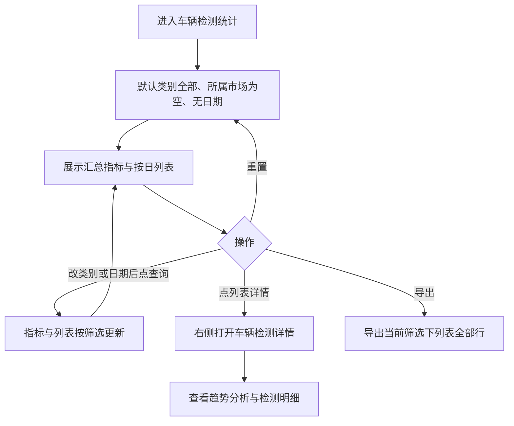

<!-- #AI:prd:file -->
# PRD：数据中心 · 车辆检测统计

- 所属系统：花乡商管 PC（市场端管理后台）
- 所属模块：**数据中心** / **车辆检测统计**
- 需求类型：数据统计报表（列表 + 汇总 + 详情）
- 涉及端：PC
- 真源：预览页 `preview/inspect-report.html`（页面已确认可用）
- 文档状态：**已全部确认**（2026-09-04）；指标口径、导出（Excel）、空态（本期不做）、权限（PC 后台配置）、详情抽屉口径均已拍板

## 变更记录

| 日期 | 变更内容 |
| --- | --- |
| 2026-09-03 | 初版。按已确认预览页整理字段、筛选、指标、列表、详情抽屉；口径与导出列入待确认 |
| 2026-09-03 | 【本次更新】指标统一为「入库检测数量」；写入各指标口径；导出为列表全部行（不含操作） |
| 2026-09-03 | 【本次更新】指标标题：检测量同比、检测量同比增幅、检测量环比、检测量环比增幅 |
| 2026-09-04 | YAN 确认：空态本期不做（线上已有兜底）；权限按 PC 端后台配置；导出为 Excel；详情抽屉口径待解释后确认 |
| 2026-09-04 | YAN 确认详情抽屉口径：通过率=通过数÷总数；明细来自已录入检测报告；结果仅通过/未通过。**PRD 全部定稿** |
| 2026-09-07 | 调整展示：8 项指标拆为两行、每行 4 项；按日列表增加序号列 |
| 2026-09-07 | 按确认需求增加所属市场筛选，列表序号后增加所属市场列，并同步导出字段 |
| 2026-09-07 | 列表日期统一展示时分秒 |

> 实现与验收以本文表格为准。预览中的数字均为假数据，不作为统计口径或验收数值。

## 第一部分 · 概念对齐

市场员工在 PC 数据中心查看车辆检测相关汇总与按日明细，并可打开某日详情看趋势与检测明细。本期只覆盖「车辆检测统计」一页，不含数据中心其他报表。

## 第二部分 · 落地需求

## 1. 业务目标

在数据中心提供车辆检测统计：按类别、所属市场、日期筛选后，同时更新上方汇总指标与下方按日列表；从列表进入某日详情查看趋势分析与检测明细。

## 2. 入口与范围

- 入口：数据中心 → 车辆检测统计
- 本期页面：本报表（筛选 + 指标 + 列表 + 详情抽屉）
- 不做：数据中心其它子菜单

## 3. 核心动线



## 4. 功能清单

```
车辆检测统计
├── 筛选：类别、所属市场、日期；查询 / 重置 / 导出
├── 上方数据展示（8 项指标，两行×四项）
├── 按日列表 + 分页
└── 列表「详情」→ 右侧抽屉（趋势分析 + 检测明细）
```

页面骨架（内容区，不含系统壳）：

```
┌─────────────────────────────────────────┐
│ 类别 [全部▼]  日期 [开始 至 结束]         │
│ [查询] [重置] [导出]                     │
├─────────────────────────────────────────┤
│ 入库数量 | 出库数量 | 入库检测数量 | …     │
├─────────────────────────────────────────┤
│ 日期 | 入库数量 | 出库数量 | 入库检测数量 | 操作 │
│ …                                    详情 │
├─────────────────────────────────────────┤
│                              分页         │
└─────────────────────────────────────────┘
详情：右侧抽屉「车辆检测详情」
```

## 5. 页面字段与交互

### 5.1 筛选

筛选作用于**上方指标**和**下方列表**，二者共用同一套条件。点「查询」后列表与指标按当前条件更新。

| 字段 | 控件 | 选项 / 格式 | 默认 | 说明 |
| --- | --- | --- | --- | --- |
| 类别 | 下拉 | 全部、出库车辆、入库车辆 | 全部 | 预览中列表行带类别；选「全部」不过滤类别 |
| 所属市场 | 下拉 | 市场列表 | 空 | 选定后仅展示对应市场数据；为空不过滤 |
| 日期 | 日期范围 | 开始日期 至 结束日期 | 空 | 有值时按行「日期」落在区间内过滤；列表展示格式为 YYYY-MM-DD HH:mm:ss |
| 查询 | 按钮 | — | — | 按当前筛选刷新指标与列表，页码回到第 1 页 |
| 重置 | 按钮 | — | — | 类别恢复「全部」，日期清空，页码回到第 1 页 |
| 导出 | 按钮 | — | — | 导出当前筛选条件下，列表全部行（含未在当前页的行），**Excel（.xlsx）格式**。列为：日期、所属市场、入库数量、出库数量、入库检测数量。不含「操作」。 |

日期变化时：汇总数值、检测车辆占比随筛选更新。检测量同比、检测量环比下方日期按 5.2 默认区间展示。

### 5.2 上方数据展示

从左到右顺序如下。带「辆」的项：单位为小号文字，与数值底部对齐。检测量同比、检测量环比及其增幅下方展示对应日期。

指标名称统一为 **入库检测数量**（不再使用「入库检测量」）。

| 顺序 | 指标名 | 单位 | 指标下日期 | 口径 |
| --- | --- | --- | --- | --- |
| 1 | 入库数量 | 辆 | 无 | 车辆入库数量 |
| 2 | 出库数量 | 辆 | 无 | 车辆出库数量 |
| 3 | 入库检测数量 | 辆 | 无 | 带有检测报告的入库车辆 |
| 4 | 检测车辆占比 | % | 无 | （入库检测数量 ÷ 入库数量）×100% |
| 5 | 检测量同比 | 辆 | 有 | 默认本月 1 日至本日 |
| 6 | 检测量同比增幅 | % | 有（与检测量同比同一段日期） | 同比时间段内，（去年的入库检测数量 ÷ 今年的入库检测数量）×100% |
| 7 | 检测量环比 | 辆 | 有 | 默认上月 1 日至上月的本日 |
| 8 | 检测量环比增幅 | % | 有（与检测量环比同一段日期） | 环比时间段内，（上月的入库检测数量 ÷ 本月的入库检测数量）×100% |

预览中的数字为假数据，不作为验收数值。

### 5.3 列表

横向列（预览分页：每页 10 条；预览假数据 20 条，**真实条数与分页规格待确认**）：

| 列名 | 说明 |
| --- | --- |
| 序号 | 按当前列表从上到下连续递增 |
| 所属市场 | 该行统计所属市场 |
| 日期 | 该行统计日，展示格式为 YYYY-MM-DD HH:mm:ss |
| 入库数量 | — |
| 出库数量 | — |
| 入库检测数量 | 带有检测报告的入库车辆 |
| 操作 | 「详情」 |

点「详情」打开右侧抽屉，宽度为页面约 82%。

### 5.4 详情抽屉

标题：**车辆检测详情**。

| 区块 | 内容 |
| --- | --- |
| 日期 | 展示对应列表行的日期 |
| 趋势分析 | 环形图图例：检测通过、检测未通过；**检测通过率 = 检测通过数 ÷ 检测总数** |
| 趋势分析 · 四项 | 检测总数、检测通过、检测未通过、未通过占比 |
| 检测明细表 | 品牌车系、车架号、检测时间、检测结果；数据来自**已录入车辆的检测报告**；**检测结果仅两种取值：通过 / 未通过** |

以上口径已于 2026-09-04 由 YAN 确认；预览详情数字仍为假数据。

## 6. 文案（页面可见）

与预览一致，不另造同义文案：

- 菜单 / 页：车辆检测统计
- 筛选标签：类别、所属市场、日期；按钮：查询、重置、导出
- 类别选项：全部、出库车辆、入库车辆
- 日期占位：开始日期、结束日期；分隔：至
- 列表操作：详情
- 抽屉标题：车辆检测详情；区块标题：趋势分析
- 图例：检测通过、检测未通过

## 7. 待确认事项

| 项 | 状态 |
| --- | --- |
| 无数据 / 加载失败如何展示 | ✅ 已确认（2026-09-04）：本期不做，线上版本已有兜底 |
| 角色与数据权限 | ✅ 已确认（2026-09-04）：按 PC 端后台权限配置，不在本需求内定义 |
| 详情趋势与明细的真实口径及检测结果枚举 | ✅ 已确认（2026-09-04）：通过率=检测通过数÷检测总数；明细来自已录入车辆的检测报告；结果仅通过/未通过 |
| 导出文件格式 | ✅ 已确认（2026-09-04）：Excel（.xlsx） |

## 8. 本期不写

导航壳、技术栈、组件规范、预览地址与端口（见项目 `AGENTS.md` 与 `设计规范/PC/`）。
